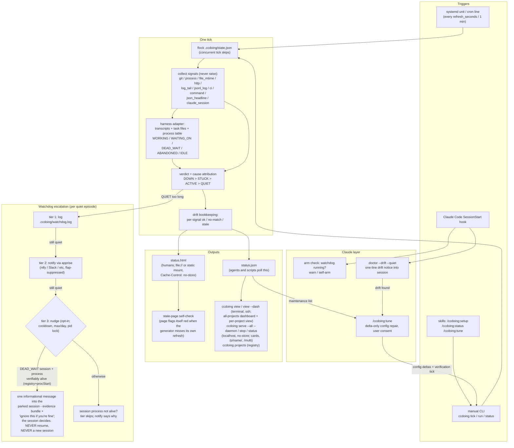

# whats-cc-doing: flow and triggers

One-page map of what triggers ccdoing, what a tick does, and where the
watchdog escalation can end up. Standalone on purpose - safe to delete.

Reading notes:

- Everything on the left half is deterministic and LLM-free; Claude
  appears only in the bottom-right (session notices, tune, and the
  opt-in tier-3 nudge).
- There is no timer hook in Claude Code - the periodic loop lives in
  systemd/cron; SessionStart is the only automatic Claude-side trigger.
- ABANDONED sessions (older than stuck_max_age_minutes) never produce
  STUCK and are never nudged; IDLE is sacred - a finished session
  sitting open overnight is healthy and left alone.
- Nothing here resumes or spawns sessions. Tier 3 delivers at most one
  message; only the session itself knows whether it still has work.
